# 🚀 Hello Static — Статический сайт с CI/CD на GitHub Pages

[](https://github.com/kotokhin98-netizen/hello-static/actions/workflows/ci-cd.yml)
[](https://kotokhin98-netizen.github.io/hello-static/)
[](LICENSE)

Простой статический сайт на **HTML + CSS + JavaScript** с автоматическим деплоем на **GitHub Pages** через **GitHub Actions CI/CD**.

🔗 **Живой сайт:** https://kotokhin98-netizen.github.io/hello-static/

---

##  Содержание

- [О проекте](#о-проекте)
- [Технологии](#технологии)
- [Структура проекта](#структура-проекта)
- [Локальный запуск](#локальный-запуск)
- [CI/CD Pipeline](#cicd-pipeline)
- [Скриншоты](#скриншоты)
- [Что освоено](#что-освоено)

---

## 🎯 О проекте

Этот проект демонстрирует **настоящий Continuous Deployment** для статического сайта:

- ✅ **Нет сборки** — файлы деплоятся как есть
- ✅ **Автоматическая валидация** HTML, CSS и JS через линтеры
- ✅ **Гейтинг деплоя** — `deploy` не запустится, если `ci` упал
- ✅ **Относительные пути** — работают на GitHub Pages без настройки `base`
- ✅ **CDN** — GitHub Pages автоматически раздаёт статику по всему миру

---

## 🛠 Технологии

| Категория | Инструмент |
|-----------|-----------|
| **Разметка** | HTML5 |
| **Стили** | CSS3 (Color 4 syntax) |
| **Скрипты** | Vanilla JavaScript (ES2022) |
| **Хостинг** | GitHub Pages |
| **CI/CD** | GitHub Actions |
| **Линтеры** | `html-validate`, `stylelint`, `eslint` |
| **Контейнеризация** | Docker (Node 20 Alpine, Nginx Alpine) |

---

##  Структура проекта

```
hello-static/
── .github/
│   └── workflows/
│       └── ci-cd.yml          # CI/CD pipeline
├── public/                     # Папка для деплоя
│   ├── favicon.svg
│   ├── index.html
│   ├── script.js
│   └── style.css
├── .gitignore
├── .htmlvalidate.json          # Конфиг html-validate
├── .stylelintrc.json           # Конфиг stylelint
├── eslint.config.js            # Конфиг eslint
├── package.json
└── package-lock.json
```

> 💡 Папка `public/` деплоится на GitHub Pages **как есть** — без сборки.

---

## 🖥 Локальный запуск

### Требования
- [Docker Desktop](https://www.docker.com/products/docker-desktop/) (должен быть запущен)
- Git Bash или PowerShell

### 1. Установка зависимостей

```powershell
cd hello-static
docker run --rm -e HOME=/tmp `
  -v "${PWD}:/app" `
  -w /app `
  node:20-alpine `
  npm install
```

### 2. Валидация кода (линтеры)

```powershell
docker run --rm -e HOME=/tmp `
  -v "${PWD}:/app" `
  -w /app `
  node:20-alpine `
  sh -c "npm ci && npm run lint"
```

**Ожидаемый вывод:**
```
> hello-static@0.1.0 lint:html
> html-validate "public/**/*.html"

> hello-static@0.1.0 lint:css
> stylelint "public/**/*.css"

> hello-static@0.1.0 lint:js
> eslint "public/**/*.js"
```

### 3. Просмотр сайта через Nginx

```powershell
docker run --rm -p 8081:80 `
  -v "${PWD}/public:/usr/share/nginx/html:ro" `
  nginx:alpine
```

Откройте: **http://localhost:8081/**

> ⚠️ После проверки нажмите `Ctrl + C` в терминале.

---

## 🔄 CI/CD Pipeline

### Workflow: `ci-cd.yml`

```yaml
name: CI/CD

on:
  push:
    branches: [ main ]
  pull_request:

permissions:
  contents: read
  pages: write
  id-token: write

concurrency:
  group: "pages"
  cancel-in-progress: false

jobs:
  ci:
    runs-on: ubuntu-latest
    steps:
      - uses: actions/checkout@v4
      - name: Setup Node.js
        uses: actions/setup-node@v4
        with:
          node-version: '20'
          cache: npm
      - name: Install dependencies
        run: npm ci
      - name: Lint HTML
        run: npm run lint:html
      - name: Lint CSS
        run: npm run lint:css
      - name: Lint JS
        run: npm run lint:js
      - name: Upload public artifact
        uses: actions/upload-artifact@v4
        with:
          name: public
          path: public
          retention-days: 1

  deploy:
    needs: ci
    if: github.ref == 'refs/heads/main'
    runs-on: ubuntu-latest
    environment:
      name: github-pages
      url: ${{ steps.deployment.outputs.page_url }}
    steps:
      - name: Download public artifact
        uses: actions/download-artifact@v4
        with:
          name: public
          path: public
      - name: Setup Pages
        uses: actions/configure-pages@v5
      - name: Upload artifact to Pages
        uses: actions/upload-pages-artifact@v3
        with:
          path: ./public
      - name: Deploy to GitHub Pages
        id: deployment
        uses: actions/deploy-pages@v4
```

### Как это работает

```
┌─────────────────────────────────────────────────────────┐
│  Push в main                                            │
└────────────────────┬────────────────────────────────────┘
                     ▼
─────────────────────────────────────────────────────────┐
│  Job: ci                                                │
│  • npm ci (установка зависимостей)                      │
│  • lint:html (html-validate)                            │
│  • lint:css  (stylelint)                                │
│  • lint:js   (eslint)                                   │
│  • upload-artifact (папка public/)                      │
└────────────────────┬────────────────────────────────────┘
                     │ needs: ci
                     ▼
┌─────────────────────────────────────────────────────────┐
│  Job: deploy (только если ci ✅)                         │
│  • download-artifact                                    │
│  • configure-pages                                      │
│  • upload-pages-artifact (path: ./public)               │
│  • deploy-pages → GitHub Pages CDN                      │
─────────────────────────────────────────────────────────┘
```

### Continuous Deployment vs Continuous Delivery

| Тип | Описание | Этот проект |
|-----|----------|:-----------:|
| **CI** | Автоматическая проверка кода | ✅ `job: ci` |
| **CDel** | Готовит релиз, деплой вручную | ❌ |
| **CDep** | Автодеплой после CI | ✅ `job: deploy` |

> 💡 **Ключевая особенность:** `needs: ci` — деплой **не запустится**, если валидация упала. Это и есть настоящий Continuous Deployment.

---


---

## 🎓 Что освоено

- **Валидация статики** — `html-validate`, `stylelint`, `eslint` без сборки
- **GitHub Pages** — бесплатный хостинг с HTTPS и CDN
- **GitHub Actions** — настройка workflow с двумя job'ами
- **`needs: ci`** — гейтинг деплоя (настоящий CD)
- **`environment: github-pages`** — привязка к окружению с историей
- **`actions/upload-pages-artifact`** — прямая загрузка без сборки
- **Относительные пути** — `./style.css` работает на Pages без `base`
- **Docker** — локальная проверка через контейнеры Node и Nginx
- **Environments & Deployments** — история развёртываний

---

## 🔑 Ключевые отличия от React-проекта

| Аспект | React SPA | Hello Static |
|--------|:---------:|:------------:|
| **Сборка** | Vite + tsc | ❌ Нет сборки |
| **`base` path** | Обязателен |  Не нужен |
| **Что деплоится** | `dist/` после сборки | `public/` как есть |
| **CI-проверки** | lint + types + tests + build | lint HTML/CSS/JS |
| **Время до продакшена** | 2–3 минуты | 30–60 секунд |
| **Сложность** | Средняя | Низкая |

---

## 📝 Лицензия

MIT © 2026 kotokhin98-netizen

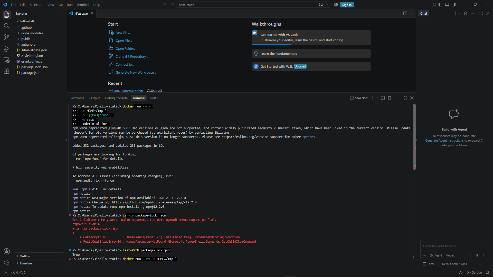
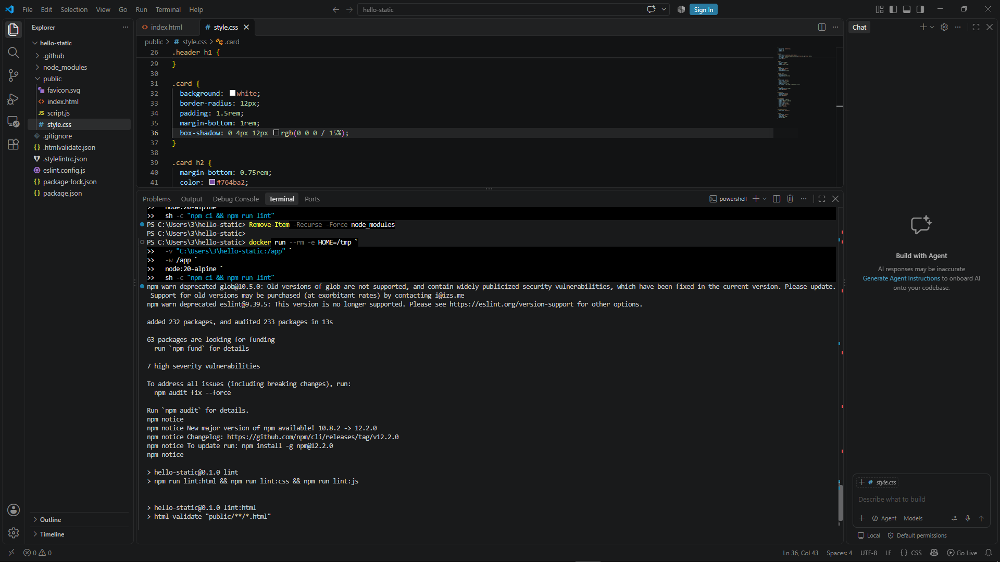
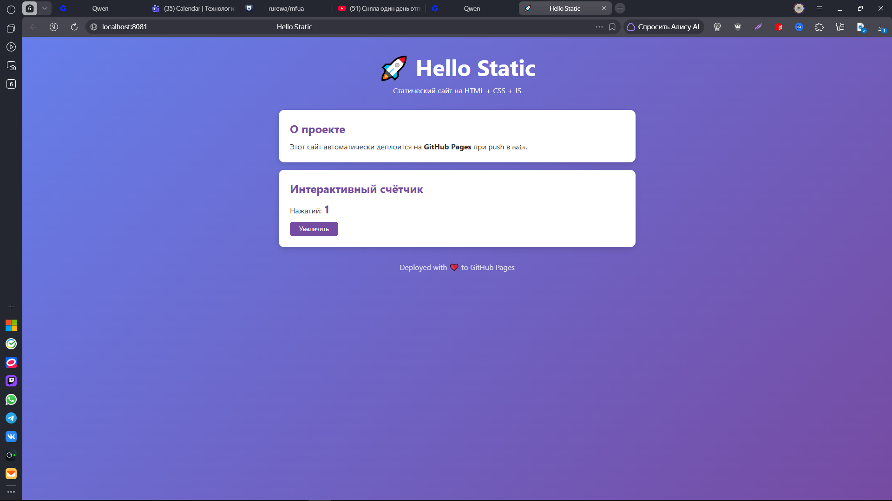
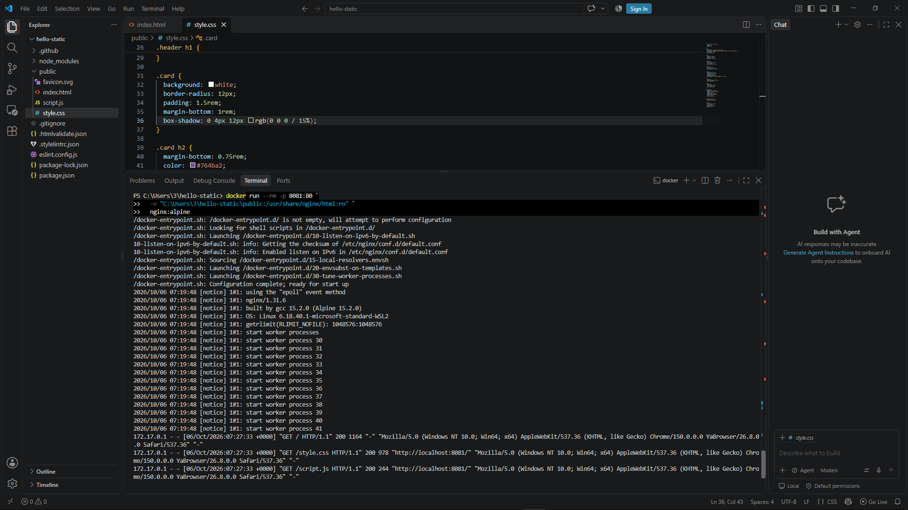
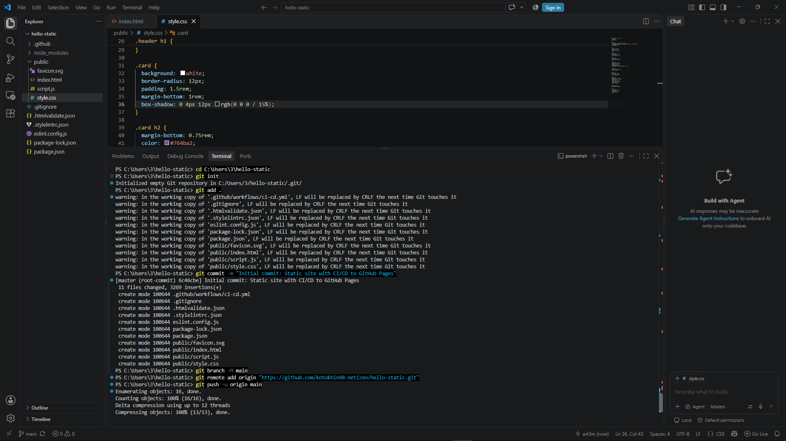
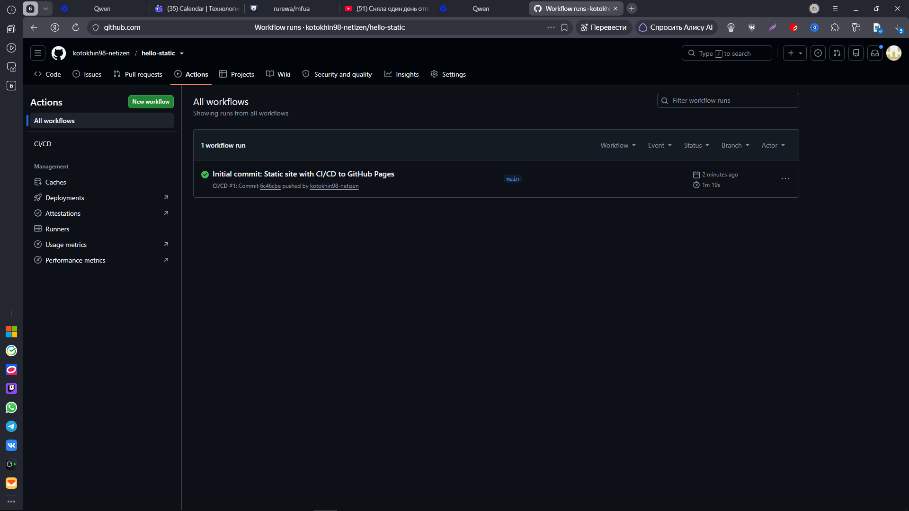
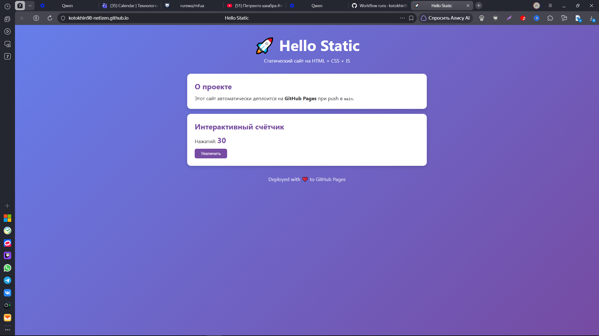
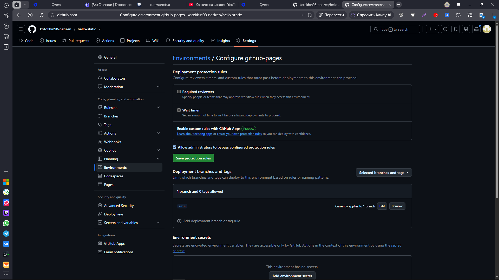
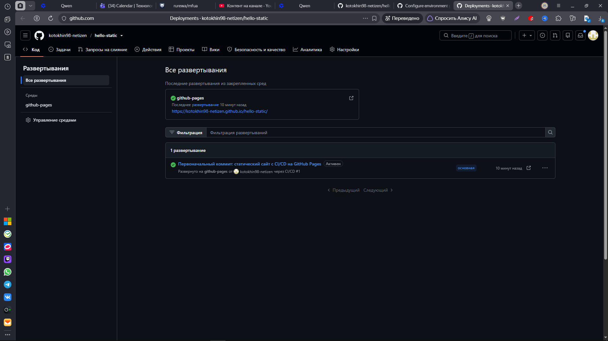
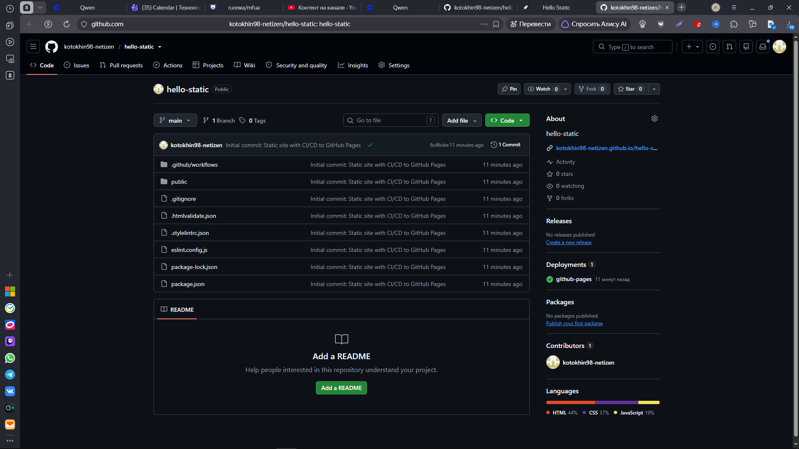
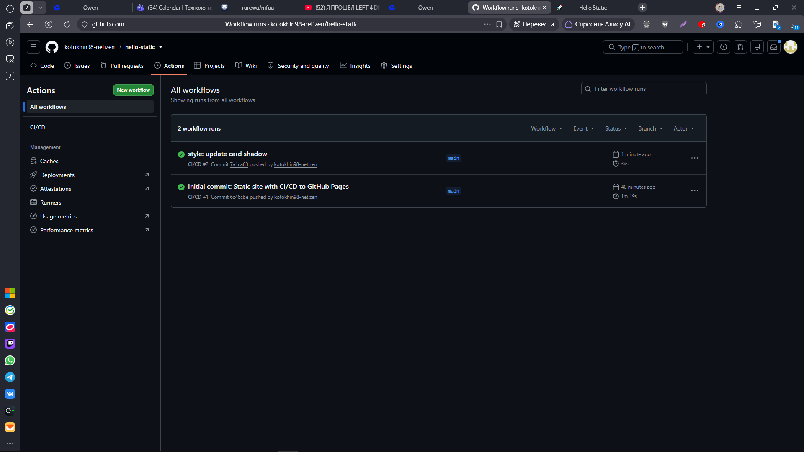

---

> 💡 **Главный урок:** статический сайт не требует сборки. Достаточно относительных путей и `actions/upload-pages-artifact` с `path: ./public` — и сайт уезжает на Pages. А `needs: ci` делает это настоящим CD.